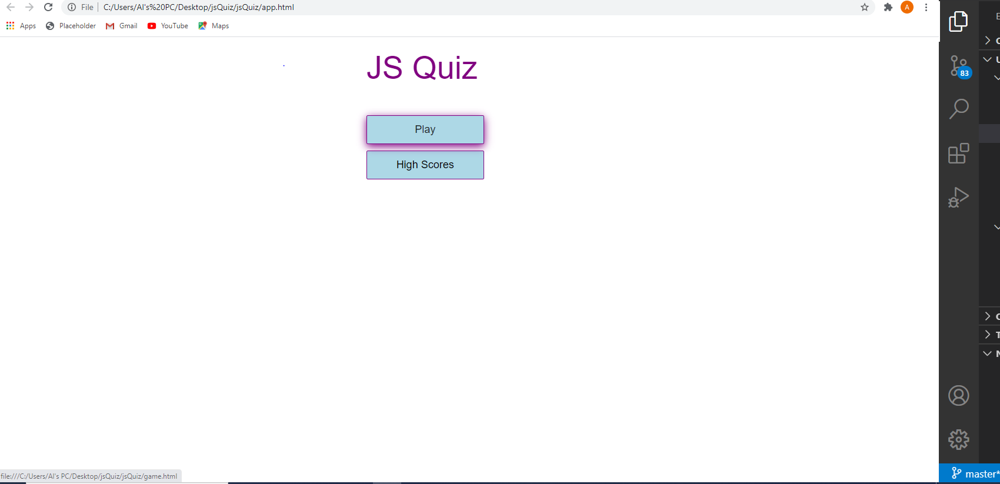

# 04 Web APIs: Code Quiz

 This is a timed code quiz with multiple-choice questions. This app will run in the browser and features dynamically updated HTML and CSS powered by JavaScript code. It also features a clean and polished user interface and is responsive, ensuring that it adapts to multiple screen sizes.


## Acceptance Criteria

```
GIVEN you are taking a code quiz
WHEN you click the start button
THEN a timer starts and you are presented with a question
WHEN you answer a question
THEN you are presented with another question
WHEN you answer a question incorrectly
THEN time is subtracted from the clock
WHEN all questions are answered or the timer reaches 0
THEN the game is over
WHEN the game is over
THEN you can save your initials and score
```

The following is a screenshot of the opening page of the JS quiz:



## Click below to play
[JS Quiz]( https://chefbrams.github.io/jsQuiz/.)
- - -
© 2019 Trilogy Education Services, a 2U, Inc. brand. All Rights Reserved.
